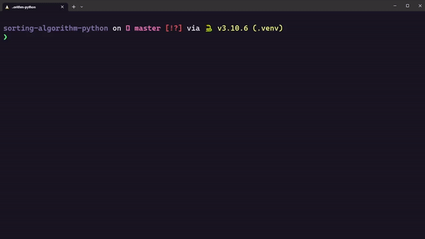
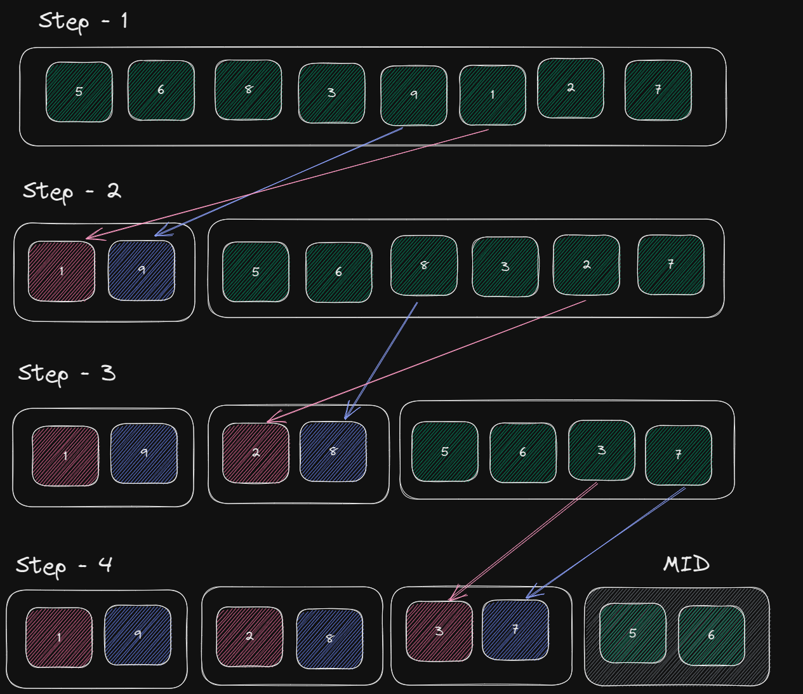
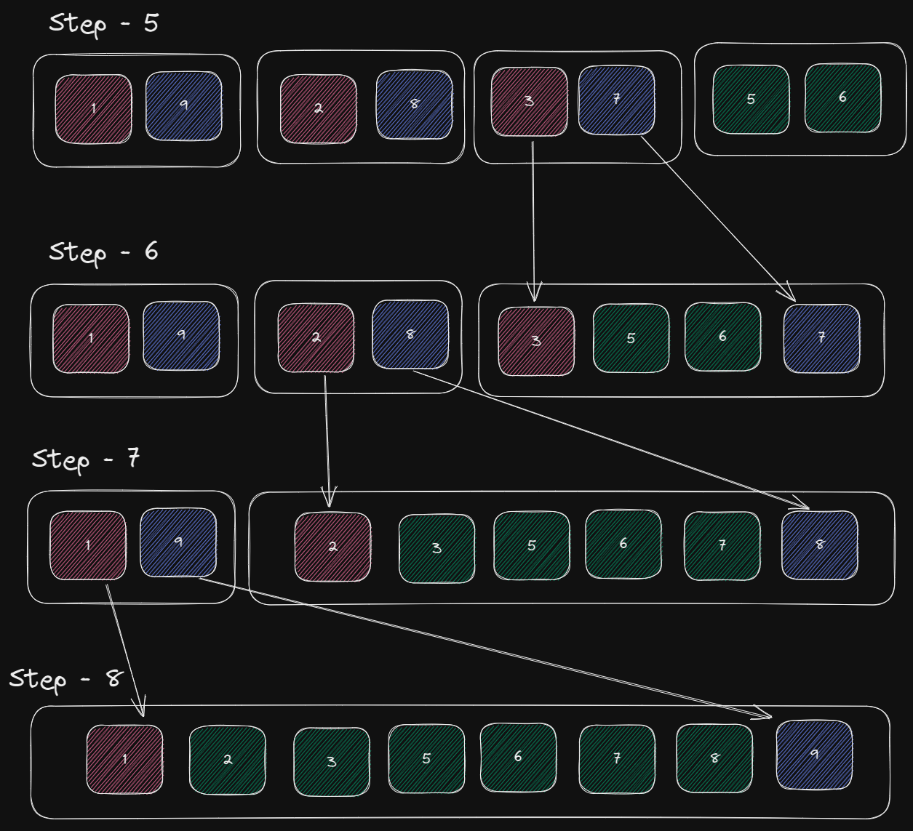

<div align="center" id="top"> 
  

  &#xa0;

  <!-- <a href="https://python.netlify.app">Demo</a> -->
</div>

<h1 align="center">Sorting Algorithm Python</h1>

<p align="center">
  

  

  

  <!--  -->

  <!--  -->

  <!--  -->

  <!--  -->
</p>

O algoritmo `sorte` é uma implementação do algoritmo de ordenação QuickSort em Python. Ele utiliza a recursão para dividir a lista em partes menores e ordenar cada uma delas separadamente.

# Como utilizar
Para utilizar o algoritmo, basta chamar a função ``sorte`` passando uma lista de inteiros como argumento. A função retorna a lista ordenada.

```python
lista = [4, 2, 1, 3, 5]
lista_ordenada = sorte(lista)
print(lista_ordenada)  # [1, 2, 3, 4, 5]
```

# Como funciona

A lógica por trás da é ir quebrando a lista sempre pegando o maior e menor numero e retirando da lista como mostra a imagem abaixo.



Após chegar na menor parte possível é hora de juntar todas as listas novamente, só que agora vamos jogando o maior para o final e menor para o inicio, assim ordenando a lista de forma crescente corretamente.




# Teste de desempenho

Para testar o desempenho do algoritmo em diferentes tamanhos de entrada, basta chamar a função test_time, passando como argumento o tamanho da lista a ser ordenada. A função irá imprimir o tempo de execução da função sorte e da função nativa do Python sorted.

## Exemplo:

```python
test_time(1) # Teste de performance para uma lista com 5 itens
test_time(100) # Teste de performance para uma lista com 500 itens
```
